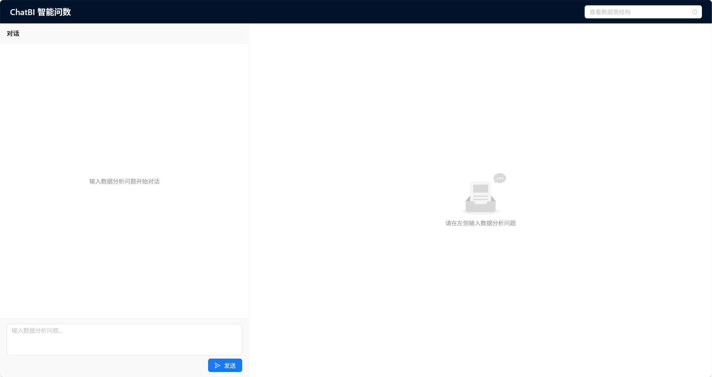
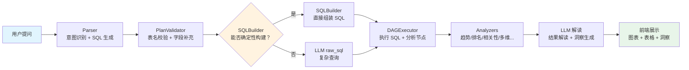

<div align="center">

# ChatBI 智能问数

**用自然语言提问，秒级生成 BI 分析报告 — 从数据到洞察，一句话就够了**

[](https://www.python.org/)
[](https://nextjs.org/)
[](https://www.postgresql.org/)
[]()

<!-- 截图占位：替换 docs/images/demo.png 为你的系统界面截图 -->


</div>

---

## 目录

- [项目简介](#项目简介)
- [核心功能](#核心功能)
- [系统架构](#系统架构)
- [技术栈](#技术栈)
- [快速开始](#快速开始)
- [使用指南](#使用指南)
- [项目结构](#项目结构)
- [FAQ](#faq)
- [贡献指南](#贡献指南)

---

## 项目简介

**ChatBI 智能问数**是一个基于大语言模型的对话式商业智能系统。用户只需用自然语言提出数据分析需求，系统即可自动完成 SQL 生成、数据查询、统计分析和可视化呈现的全流程。

### 痛点

传统 BI 工具要求用户具备 SQL 编写能力或熟悉复杂的报表拖拽操作，数据分析的门槛高、周期长。业务人员有了数据需求，往往需要排队等待数据团队排期，从提问到看到结果可能需要数天。

### 解决方案

ChatBI 将这一流程压缩到**一次对话**：

```
你问："2023年各省GDP增长率排名，哪些省份超过了全国平均水平？"
   ↓
ChatBI：自动生成 SQL → 查询数据库 → 排名计算 → 图表展示 → 洞察解读
   ↓
你得到：排名图表 + 数据表格 + "广东、江苏等5省超过全国均值3.2%..."
```

### 核心差异化

| 特性 | 说明 |
|------|------|
| **三层防御架构** | PlanValidator 校验修复 → SQLBuilder 确定性构建 → 执行时列名清洗，层层保障质量 |
| **双路 Schema RAG** | 指标注册表确定性匹配 + BGE-m3 语义向量检索，精准定位相关数据表 |
| **动态数据表导入** | CSV/Excel 一键上传，自动注册 schema、推断指标、检测关联，立即可查询 |
| **确定性 SQL 构建器** | 简单查询直接组装 SQL，不经过 LLM，零幻觉风险 |

---

## 核心功能

- **10 种分析类型**：趋势分析、排名、相关性、异常检测、多维分析、跨域对比、综合评价、空间分析、详情查询、高级分析
- **双路 Schema RAG**：指标注册表（确定性匹配业务指标名）+ BGE-m3 语义向量检索（模糊匹配表结构），双路融合确保表选择准确
- **确定性 SQL 构建器**：对简单查询场景（单表/多表 JOIN/聚合/排行），直接从结构化字段组装 SQL，不经过 LLM 生成，消除幻觉
- **动态数据表导入**：前端上传 CSV/Excel → 自动建表入库 → 自动生成指标定义 → 自动检测 JOIN 关系 → 立即可用于提问
- **SSE 流式响应**：分阶段推送进度事件（解析中 → SQL 生成 → 查询执行 → 分析计算 → 解读生成），前端实时展示
- **全链路 Trace**：每个环节（Parser / Validator / SQLBuilder / Executor / Analyzer）的耗时、状态、中间结果均可追溯
- **前端可视化**：ECharts 图表（折线/柱状/饼图/雷达/散点等）+ 数据表格 + LLM 生成的洞察解读，三栏展示

---

## 系统架构



**数据流说明**：

1. **Parser**：接收自然语言，通过 LLM 生成结构化分析计划（分析类型、指标、表名、SQL）
2. **PlanValidator**：校验表名是否存在、补充缺失字段、清洗脏数据（如 `dim_cols=["*"]`）
3. **SQLBuilder**：对简单查询直接组装 SQL（零幻觉）；复杂查询回退到 LLM raw_sql
4. **DAGExecutor**：按 DAG 拓扑顺序执行 SQL 节点和分析节点
5. **Analyzers**：10 种分析算法（趋势/排名/相关性/异常/多维/跨域/综合等）
6. **LLM 解读**：基于查询结果生成自然语言洞察
7. **前端展示**：图表 + 数据表格 + 洞察文本三栏呈现

---

## 技术栈

| 层 | 技术 | 用途 |
|---|---|---|
| 后端框架 | FastAPI | REST API + SSE 流式推送 |
| LLM | 通义千问 qwen-max（兼容 OpenAI 协议） | SQL 生成 + 结果解读 |
| Embedding | BAAI/bge-m3 | Schema 语义向量检索 |
| 数据库 | PostgreSQL 14+ | 数据存储 |
| 数据操作 | pandas + asyncpg | 数据处理 + 异步查询 |
| 前端框架 | Next.js 14 + React 18 | SPA 界面 |
| UI 组件 | Ant Design 6 | 界面组件库 |
| 图表 | ECharts 6 | 数据可视化 |

---

## 快速开始

### 环境要求

- Python 3.10+
- Node.js 18+
- PostgreSQL 14+

### 1. 克隆项目

```bash
git clone https://github.com/your-username/chatbi-agent.git
cd chatbi-agent
```

### 2. 配置后端

```bash
cd backend

# 安装 Python 依赖
pip install -r requirements.txt

# 复制环境变量模板并填入配置
cp ../.env.example .env
# 编辑 .env，至少配置以下两项：
#   DB_DSN=postgresql://用户名:密码@localhost:5432/数据库名
#   OPENAI_API_KEY=你的API密钥

# 启动后端服务
uvicorn app.main:app --host 0.0.0.0 --port 8004 --reload
```

### 3. 启动前端

```bash
cd frontend

# 安装 Node 依赖
npm install

# 启动开发服务器
npm run dev
```

### 4. 访问系统

打开浏览器访问 **http://localhost:3000**，即可开始提问。

> **提示**：首次启动时，系统会自动扫描数据库中的所有表并构建 Schema 向量索引，可能需要 10-30 秒（取决于表数量和 Embedding 模型加载时间）。

---

## 使用指南

### 提问示例

| 难度 | 问句 | 分析类型 |
|------|------|---------|
| L1 基础 | "2023年各省GDP排名" | 排名 |
| L2 趋势 | "从2020年到2023年，全国GDP的增长趋势如何？" | 趋势分析 |
| L3 多维 | "2023年各省的固定资产投资收益率如何？按省份计算投资与GDP的比值" | 多维分析 |
| L4 跨域 | "比较2023年各省的教育投入与医疗投入水平" | 跨域对比 |
| L5 综合 | "构建区域发展综合指数，包含经济、教育、医疗、环境四个维度" | 综合评价 |

### 数据表导入

1. 点击右上角表选择器旁的 **「+ 导入新数据表」**
2. 拖拽或选择 CSV/Excel 文件（支持 `.csv`、`.xlsx`、`.xls`）
3. 系统自动：推断表名 → 解析列类型 → 创建数据库表 → 注册指标 → 检测关联关系
4. 导入完成后，即可在聊天中提问涉及新表的问题

### 高级配置

| 配置项 | 环境变量 | 默认值 | 说明 |
|--------|---------|--------|------|
| LLM 提供商 | `OPENAI_BASE_URL` | DashScope | 任何兼容 OpenAI 协议的服务 |
| LLM 模型 | `OPENAI_MODEL` | `qwen-max` | 可切换为 `gpt-4o`、`deepseek-chat` 等 |
| Embedding 模型 | `EMBEDDING_MODEL` | `BAAI/bge-m3` | 语义检索模型 |
| HuggingFace 镜像 | `HF_ENDPOINT` | - | 国内用户设置 `https://hf-mirror.com` 加速下载 |
| 缓存后端 | `CACHE_BACKEND` | `disk` | 可选 `redis` |

---

## 项目结构

```
chatbi-agent/
├── backend/
│   ├── app/
│   │   ├── analyzers/          # 分析算法（趋势/排名/相关性/异常/多维/跨域/综合）
│   │   │   ├── base.py         #   分析器基类
│   │   │   ├── time_series.py  #   趋势分析（CAGR、线性趋势）
│   │   │   ├── ranking.py      #   排名分析
│   │   │   ├── correlation.py  #   相关性分析（Pearson/Spearman）
│   │   │   ├── anomaly.py      #   异常检测（Z-Score / IQR）
│   │   │   ├── multi_dim.py    #   多维分析（Cube / Proportion）
│   │   │   ├── cross_domain.py #   跨域对比
│   │   │   └── composite.py    #   综合评价（加权评分）
│   │   ├── api/
│   │   │   ├── routes.py       #   API 路由（查询/流式/Schema/导入）
│   │   │   └── error_handler.py#   全局错误处理
│   │   ├── core/
│   │   │   └── llm.py          #   LLM 调用封装（兼容 OpenAI 协议）
│   │   ├── db/
│   │   │   ├── connector.py    #   数据库连接池（asyncpg + 自动重连）
│   │   │   └── schema_discovery.py  # Schema 自动发现（pg_catalog 扫描）
│   │   ├── engine/
│   │   │   ├── parser.py       #   自然语言解析器（意图识别 + SQL 生成）
│   │   │   ├── orchestrator.py #   DAG 编排器（构建 + 执行）
│   │   │   ├── executor.py     #   DAG 执行器
│   │   │   ├── sql_builder.py  #   确定性 SQL 构建器
│   │   │   ├── schema_rag.py   #   Schema RAG（双路融合检索）
│   │   │   ├── indicator_registry.py  # 业务指标注册表
│   │   │   ├── join_path_finder.py    # 表关联路径发现（BFS）
│   │   │   ├── plan_validator.py      # 计划校验器（三层防御）
│   │   │   ├── table_importer.py      # 动态数据表导入服务
│   │   │   └── ...             #   其他引擎模块
│   │   ├── evaluator/
│   │   │   └── metrics.py      #   评分系统（规则 + LLM Judge）
│   │   └── configs/
│   │       ├── indicators.yaml #   指标注册表（89 个业务指标）
│   │       └── join_graph.yaml #   表关联图谱（10 张表）
│   ├── config.py               #   配置中心（Pydantic Settings）
│   └── requirements.txt        #   Python 依赖
├── frontend/
│   ├── components/
│   │   ├── ChatPanel.tsx       #   对话面板
│   │   ├── ResultViewer.tsx    #   结果展示（图表/表格/洞察）
│   │   ├── DataSetSelector.tsx #   数据表选择器 + 导入入口
│   │   ├── ImportTableModal.tsx#   数据表导入弹窗
│   │   └── ...
│   ├── lib/
│   │   ├── api.ts              #   API 客户端（Axios + SSE）
│   │   └── types.ts            #   TypeScript 类型定义
│   └── pages/
│       └── index.tsx           #   主页面
├── tests/                      #   单元测试 + 基准测试
├── docs/                       #   详细文档 + 报告
├── 20_BI_questions*.md         #   100 题 BI 测试问句集
├── .env.example                #   环境变量模板
└── .gitignore
```

---

## FAQ

<details>
<summary><b>API Key 怎么配置？</b></summary>

复制 `.env.example` 为 `.env`（后端根目录），填入你的 API 密钥：

```bash
OPENAI_API_KEY=sk-your-key-here
OPENAI_BASE_URL=https://dashscope.aliyuncs.com/compatible-mode/v1
OPENAI_MODEL=qwen-max
```

支持任何兼容 OpenAI 协议的服务（DashScope / DeepSeek / OpenAI 等）。
</details>

<details>
<summary><b>HuggingFace 模型下载失败？</b></summary>

国内网络环境可能无法直接访问 HuggingFace，设置镜像加速：

```bash
# 在 .env 中添加
HF_ENDPOINT=https://hf-mirror.com
```

或者手动下载 `BAAI/bge-m3` 模型到本地，然后在 `.env` 中指定路径：

```bash
EMBEDDING_MODEL=/path/to/local/bge-m3
```
</details>

<details>
<summary><b>端口冲突怎么办？</b></summary>

后端默认端口 8004，前端默认端口 3000。如需修改：

- 后端：`uvicorn app.main:app --port 8005`
- 前端：`PORT=3001 npm run dev`
- 前端 API 地址：在 `frontend/.env.local` 中设置 `NEXT_PUBLIC_API_URL=http://localhost:8005/api`
</details>

<details>
<summary><b>数据库连接失败？</b></summary>

检查 `.env` 中的 `DB_DSN` 格式：

```
postgresql://用户名:密码@主机:端口/数据库名
```

确保 PostgreSQL 已启动且数据库已创建。系统启动时会自动扫描所有表结构。
</details>

---

## 贡献指南

欢迎提交 Issue 和 Pull Request！

1. Fork 本仓库
2. 创建功能分支：`git checkout -b feature/your-feature`
3. 提交更改：`git commit -m 'Add some feature'`
4. 推送分支：`git push origin feature/your-feature`
5. 提交 Pull Request

**Commit 规范**：

- `feat:` 新功能
- `fix:` Bug 修复
- `docs:` 文档更新
- `refactor:` 代码重构
- `test:` 测试相关
